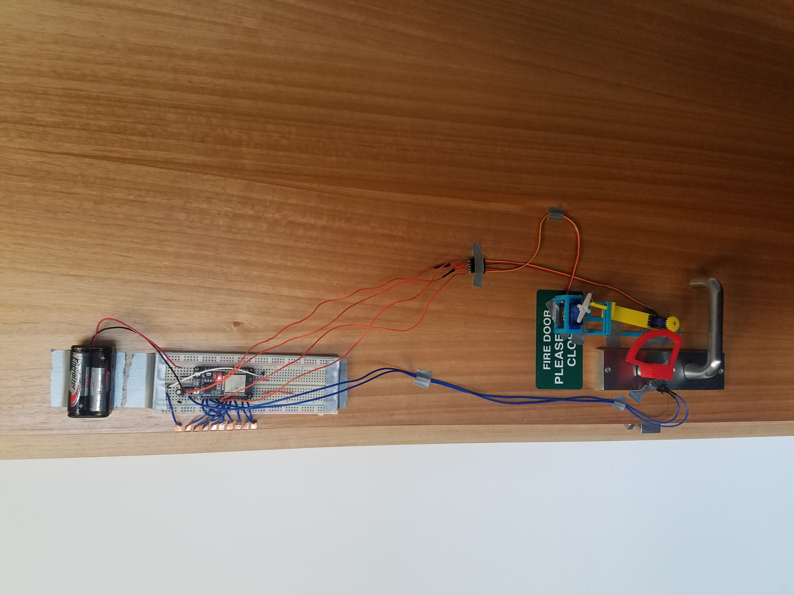

# Arcady Door Lock
This project is an electromechanical door lock, powered by an esp32 and a couple of servos.

A touchscreen is used to direct the microcontroller to lock and unlock the door. Unlocking requires a passcode to be entered.
Servo motors on the other side of the door turn gears connected to the lock.

The gears are mounted on a swinging arm so that they are only engaged during the process of locking and unlocking. This allows the lock to still be used normally with a key, without encountering the resistance of permanent gears.
Additionally, the arm removes the limiting factor of the maximum servo rotation, as I can swing the arm out of the way, rotate the gear servo backwards, then swing the arm back in and continue turning the lock.

|                                      |                                                    |
| ------------------------------------ | -------------------------------------------------- |
|  |  |

# Software
- `LGFX_SPI_ILI9488_DoorLockScreen.h` contains configuration code for the touchscreen.
- `TouchHandler.h` handles the pressing of on-screen buttons and screen timeout/sleep/wakeup.
- `main.cpp` is the main program.

There are some pin definitions at the top of the file. The main loop runs different logic depending on which state the program is in.
`drawUI()` is sometimes called to draw the current menu to the screen, however drawing is slow so this is only called when required.

This software was written for an ESP32 dev board, although others should work with slight modifications. If there is no activity on the touchscreen for 30 seconds the board goes into deepsleep and turns off the screen. It can be rebooted by pressing anywhere on the screen.

# Electronics
I was originally intending to make some PCB's for each part of the project, but I ran out of time so just used breadboards instead. Copper tape along the edge of the door was used to make connections between the breadboards on different sides of the door.

Pin connections for the screen can be found by looking through `LGFX_SPI_ILI9488_DoorLockScreen.h`. The pin connections for the servo motors and limit switches (used to detect when the door was locked) can be found at the top of `main.cpp`. Limit switches connected 3v3 to the input pin.

A 6v battery pack with decoupling capacitors was used to power the project.
